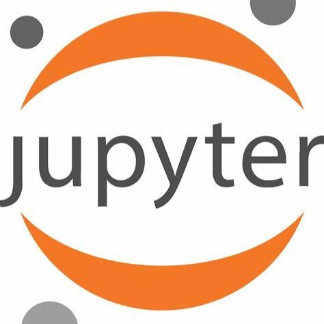
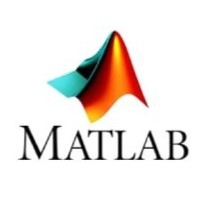
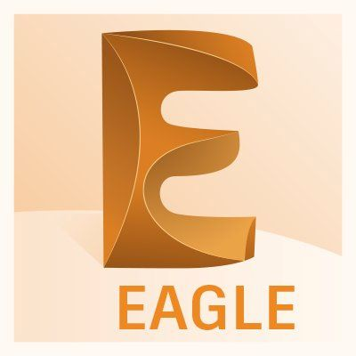

# Hi there 👋.   I'm Vincent Kiplangat, 
## Electronic and   Computer Technologists
######
#### -I'm a dedicated Data Scientist passionate about uncovering insights from complex datasets. I'm here to share my expertise from data analysis to machine learning. Whether you're a data enthusiast, a business owner, or simply curious, I've got you covered. Let's dive into the world of data science together!
#### -Have that website idea in mind and want to implement it using Django, reach out, and we actualize it. Check out some of my best projects here.
#### -Have that automation idea, which automation problem do you want to solve? is it that car detection accident system, or blind mobility aid. I got you covered.

<!--
**Kenduiwat/Kenduiwat** is a ✨ _special_ ✨ repository because its `README.md` (this file) appears on your GitHub profile.

Here are some ideas to get you started:

- 🔭 I’m currently working on ...
- 🌱 I’m currently learning ...
- 👯 I’m looking to collaborate on ...
- 🤔 I’m looking for help with ...
- 💬 Ask me about ...
- 📫 How to reach me: ...
- 😄 Pronouns: ...
- ⚡ Fun fact: ...

-->

 
 

**Major Languages and Tools:**  
| Jupyter | Python | SQL | R | Julia |
|---------|--------|-----|---|-------|
|  |  |  |  |  |

 

**Other Languages and Tools:**  
| HTML | CSS | JS | Django | C | C++ | Arduino | Proteus | Multisim | Matlab | Eagle |
|--------|--------|--------|--------|--------|--------|--------|--------|--------|--------|--------|
|  |  |  |  |  |  |  |  |  |  |  |

 
 

### :octocat: My stats

  

  

  

  

### Get in touch

  
  
  
  

# testing

